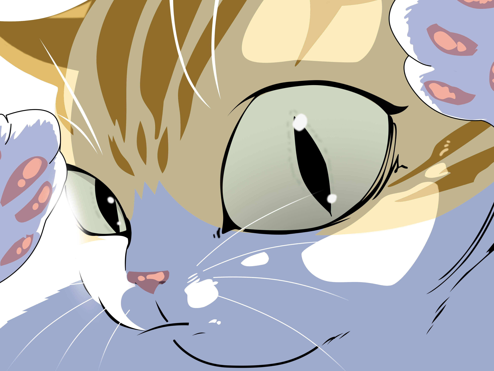

<!-- Animated Header -->

  &nbsp;&nbsp;
  

  

    
    
    
    
<!--      -->
  

  
  A passionate Computer Science Engineering student from Birla Institute of Technology Mesra Interested in all aspects related to development of software!
  My expertise includes <b>web development</b>,<b>AI/ML</b>,<b>Data Engineering.</b>

- 🔭 I’m currently working on improving my problem solving and communication skills.
- 👯 I’m looking to collaborate on projects involving python and ml concepts.
- 📫 How to reach me: 
  -Send an email to maulikagarwal8024@gmail.com
    

## 🔧 Featured Projects
- **Smart-Watch-using-ESP32-Microcontroller** - This project involves the design and development of a smart watch built using the ESP-32 microcontroller, specifically tailored to assist elderly individuals in monitoring their health and safety.[View Code](https://github.com/maulikagarwal8/Smart-Watch-using-ESP32-Microcontroller)
- **Flower Detection using CNN** – A ml model that identifies flower species from images uploaded by user. [View Code](https://github.com/maulikagarwal8/Any-Flower-Recognizer-using-CNN)
-  **Personal-AI-Health-Assistant** - Personal Health Assistant powered by AI to give approximate remedies/cures for the symptoms provided by user.[View Code](https://github.com/maulikagarwal8/Personal-AI-Health-Assistant)

## 🛠️ Technologies & Tools

   
   
  

## 📊 GitHub Statistics

<!--
**maulikagarwal8/maulikagarwal8** is a ✨ _special_ ✨ repository because its `README.md` (this file) appears on your GitHub profile.

Here are some ideas to get you started:

- 🔭 I’m currently working on ...
- 🌱 I’m currently learning ...
- 👯 I’m looking to collaborate on ...
- 🤔 I’m looking for help with ...
- 💬 Ask me about ...
- 📫 How to reach me: ...
- 😄 Pronouns: ...
- ⚡ Fun fact: ...

readme stats repo ->https://github.com/anuraghazra/convoychat & https://github.com/anuraghazra/github-readme-stats

cute cate gif currently disabled

-->
